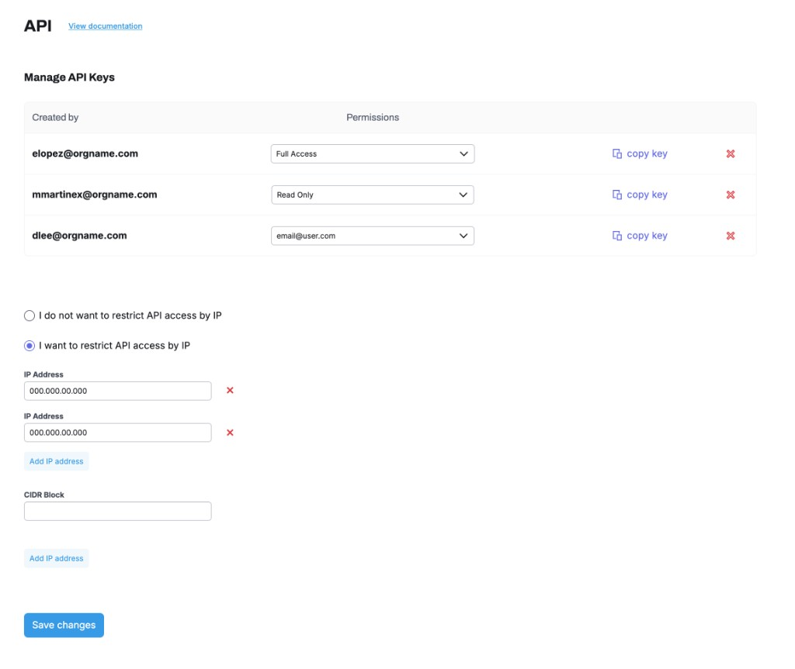

# Public API

Programmatic access to credentials, warehouses, file stores, jobs, workflows, and automation hooks.

Use this section when you need REST contracts for schedulers, ETL scripts, internal tools, or MCP clients.

## Base URL

```
https://{tenant}.ryanplatform.com/api/v1
```

All paths in this section are relative to `/api/v1` unless noted.

## Authentication

| Mechanism | Header | When |
| --- | --- | --- |
| OAuth2 access token | `Authorization: Bearer {token}` | Default for org-scoped endpoints |
| Job API key | `X-Access-Key: {key}` | Job run / status (legacy and v1 job trigger) |

Issue a token with [`POST /oauth/token`](./auth#post-oauthtoken), then call [`GET /me`](./auth#get-me) to confirm scopes.

Manage org API keys and IP restrictions in the product **API** dashboard (**Manage API Keys**).



## API key permissions

Each API key has one of three permission types:

| Permission | Behavior |
| --- | --- |
| **Users** | Key is tied to a user account. It matches the permissions specified on that user’s account (pick the user in the Permissions dropdown). |
| **Full Access** | Unrestricted API access for the organization. Recommended **only for testing or staging** accounts — not production. |
| **Read Only** | Read access only. Cannot create, update, delete, or otherwise mutate resources. |

## Successful requests

For a request to succeed, **both** must be true:

1. **Permission** — The API key’s permission type must allow the action (for **Users**, that means the linked user account must allow it; **Read Only** keys cannot perform writes).
2. **IP allow list** — When IP restriction is enabled in the API dashboard, the caller’s IP must be on the allow list: either an exact **IP address** or within a configured **CIDR block**.

If IP restriction is turned off (`I do not want to restrict API access by IP`), only the key’s permission applies. When restriction is on, requests from IPs outside the allow list are rejected even if the key would otherwise allow the action.

## Legend

| Label | Meaning |
| --- | --- |
| **Exists** | Live today (path/shape may differ; legacy noted per endpoint) |
| **New** | Expose or normalize for the public API |

## Sections

| Topic | Description |
| --- | --- |
| [Conventions](./conventions) | Errors, pagination, IDs, dates, versioning |
| [Auth & account](./auth) | Health, OAuth token, `/me`, organizations |
| [Credentials](./credentials) | List names/metadata; create, update, delete, and test (secrets never returned) |
| [Warehouses](./warehouses) | List warehouses, tables, schema, rows, exports |
| [File stores](./file-stores) | Browse, download, upload, rename, move, delete |
| [Jobs & workflows — read](./jobs-workflows-read) | Job types, definitions, runs, workflows, AI chats |
| [Jobs & workflows — write](./jobs-workflows-write) | Run jobs, create workflows, mutate AI chats |
| [Webhooks & events](./webhooks) | Subscriptions and outbound event payloads |
| [Coordinator & AI views](./coordinator-ai-views) | Coordinator chats, AI view chats, schema index |
