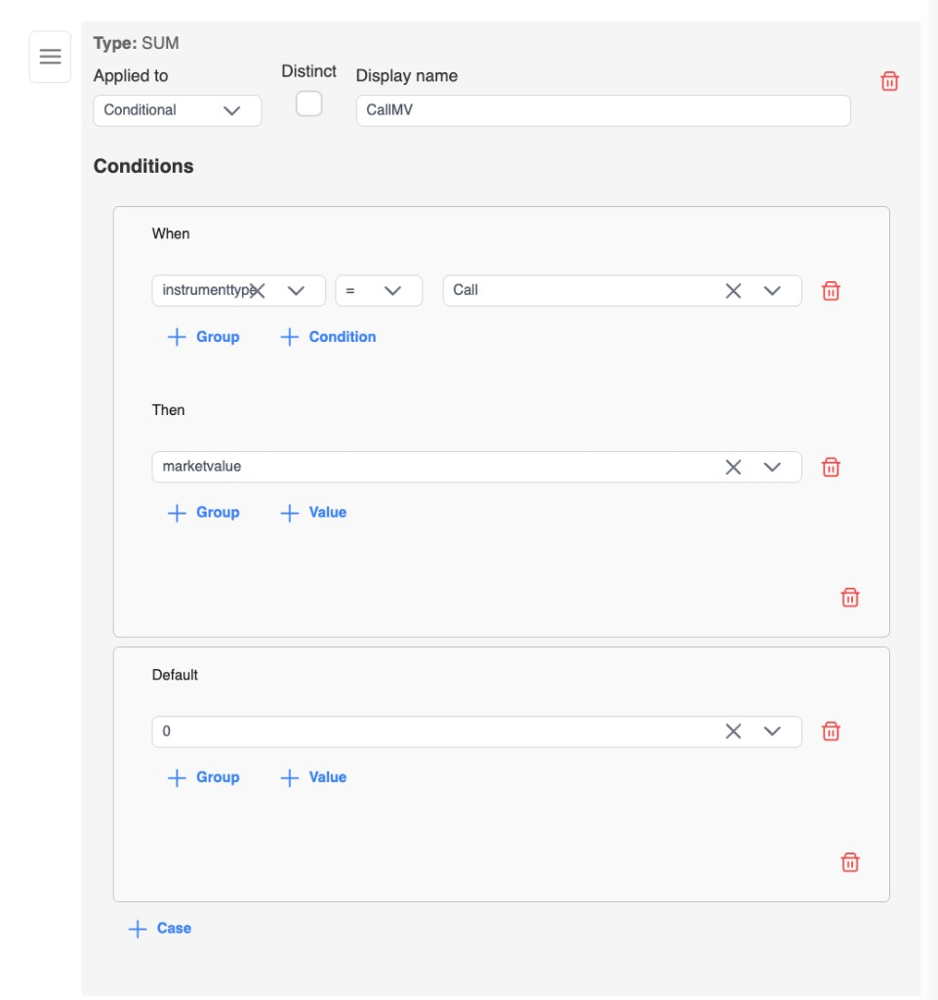

import { Callout } from 'nextra/components'

# Aggregate metrics

In aggregate (group-by) mode, select columns can be **dimensions** (usually **Reference** columns that match your group-by categories) or **measures** rolled up with **SUM**, **COUNT**, **AVG**, **MIN**, or **MAX**.

This page covers how aggregate measures work: optional `COUNT(*)`, **Distinct**, and wrapping a **column**, **calculated expression**, or **conditional (CASE)** inside the aggregate.

Enable aggregate mode first — see [Group by & aggregates](./group-by). Aggregate column types are only available when that mode is on; SQL generation rejects them otherwise.

## Aggregate column types

| Type | Purpose |
| --- | --- |
| **SUM** | Total of a numeric inner expression |
| **COUNT** | Count of rows, or of values from an inner expression |
| **AVG** | Average of a numeric inner expression |
| **MIN** | Minimum value |
| **MAX** | Maximum value |

Every measure needs a **Display name** (same rules as other select columns — see [Column types](./column-types)).

## What the aggregate wraps (inner type)

The aggregate function wraps an **inner** value. In the editor, switch the measure between:

| Inner | Meaning | Example SQL shape |
| --- | --- | --- |
| **Column** (default) | A single source column | `SUM(MarketValue)` |
| **Calculated** | Expression (`+` `-` `*` `/` `^`, with groups) | `SUM(MarketValue - CostBasis)` |
| **Conditional** | CASE / When–Then | `SUM(CASE WHEN … THEN … END)` |

Older views without an explicit inner type are treated as **Column**.

Expression JSON for calculated and conditional inners uses the same builders as standalone calculated / conditional columns in all-rows mode. The difference is that here the expression sits *inside* the aggregate.

### Column (default)

1. Leave the inner type as **Column** (or pick a table/column as usual).
2. Choose the source table and column.
3. For **COUNT**, you can leave the column empty — see below.

### Calculated

Build an expression from columns, literals, and operators (`+`, `-`, `*`, `/`, `^`), with nested groups for order of operations. The whole expression is then wrapped, for example `SUM(MarketValue - CostBasis)`.

### Conditional

Add When / Then cases (and optional Default), same pattern as a standalone conditional column. The CASE expression is wrapped, for example `SUM(CASE WHEN Side = 'L' THEN Qty ELSE 0 END)`.



## COUNT without a column

For **COUNT**, the source column is optional:

- **No column** → `COUNT(*)` (count rows in the group)
- **With a column** (or calculated / conditional inner) → count that expression’s values

Other aggregates (**SUM**, **AVG**, **MIN**, **MAX**) still require a source column or a calculated / conditional inner.

## Distinct

For **SUM**, **COUNT**, and **AVG**, enable **Distinct** so the outer aggregate uses distinct values only:

| Setting | Example SQL |
| --- | --- |
| COUNT + column + Distinct | `COUNT(DISTINCT Account)` |
| SUM + column + Distinct | `SUM(DISTINCT Amount)` |
| AVG + column + Distinct | `AVG(DISTINCT Price)` |

Rules:

- Distinct applies to the **outer** aggregate (including when the inner is calculated or conditional, where supported).
- Distinct requires an inner expression — **not** valid with empty-column `COUNT(*)` (there is no `COUNT(DISTINCT *)`).

<Callout type="info">
  **Screenshot placeholder** (`aggregate-distinct.png`)

  Placeholder: Aggregate measure with Distinct enabled and a source column selected.
</Callout>

## How SQL is built

Generation resolves the **inner** expression first, then wraps it:

```text
AGG([DISTINCT] <inner>)
```

Examples:

| Goal | Shape |
| --- | --- |
| Sum a column | `SUM(MarketValue)` |
| Sum a calculated net | `SUM(MarketValue - CostBasis)` |
| Sum a conditional amount | `SUM(CASE WHEN Side = 'L' THEN Qty ELSE 0 END)` |
| Count rows in the group | `COUNT(*)` |
| Count distinct accounts | `COUNT(DISTINCT Account)` |

## Quick reference

| You want | Configure |
| --- | --- |
| `SUM(MarketValue)` | SUM · Inner = Column · MarketValue |
| `SUM(MarketValue - CostBasis)` | SUM · Inner = Calculated · expression |
| `SUM(CASE WHEN Side = 'L' THEN Qty ELSE 0 END)` | SUM · Inner = Conditional · When/Then |
| `COUNT(*)` | COUNT · no column |
| `COUNT(DISTINCT Account)` | COUNT · Column = Account · Distinct on |

## Tips

- Use [where clauses](./where-clauses) to filter **before** aggregation.
- Keep **Reference** select columns aligned with your [group-by](./group-by) categories.
- After save, you can still edit measures (inner type, Distinct, display name) like any other select column.
- For standalone calculated / conditional columns in all-rows mode, see [Column types](./column-types).
- Hands-on walkthrough: [Aggregate metrics — options & swaps](./examples/aggregate-metrics).
