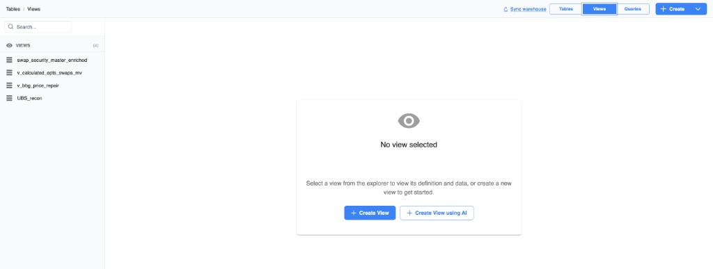
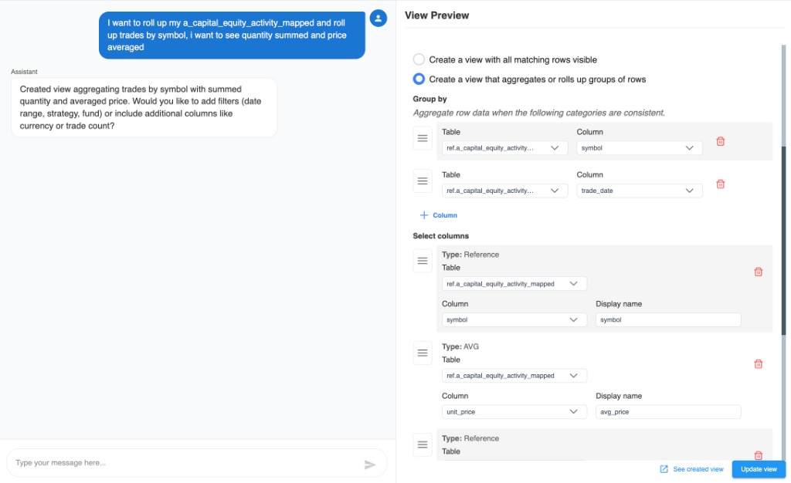

# Create with AI

**Create View using AI** opens the AI View Assistant. Describe the view you want in chat; the assistant drafts a view you can review, edit, and save.

## Open the AI View Assistant

1. On the warehouse **Views** tab, choose **Create View using AI**.
2. The AI views page opens with a chat list and conversation pane.

## Start or select a chat

- Create a **new chat**, or
- Select an existing chat from the list on the left.

If nothing is selected, you will see a prompt to choose or create a chat before messaging the assistant.

## Describe the view

1. In the conversation (**AI View Assistant**), write what you need in plain language.
2. Include useful details when you can:
   - Base table (and related tables to join)
   - Filters (where conditions)
   - Columns and display names
   - Whether you need aggregates / group by
3. Send the message and wait for the draft.

Example prompts:

- “Join positions to funds on FundId and show FundName, Quantity, and MarketValue for active positions.”
- “Sum MarketValue by Strategy and AsOfDate for the last 30 days.”
- “Add a calculated column Net = MarketValue - Cost.”

## Review the draft

The assistant fills the same view form used for manual setup:

- Schema and name
- Base table and joins
- Row mode / group by
- Select columns
- Where conditions

Edit anything that looks wrong — treat the AI output as a starting point, not a final save.

## Iterate

You can keep chatting to refine the draft (for example, “also left join accounts” or “filter out null MarketValue”). After each change, re-check joins, columns, and where clauses before saving.

## Save the view

1. Confirm schema, name, and columns.
2. Fix any validation errors in the form.
3. Save / create the view from the AI view flow.
4. The new view appears under the warehouse **Views** list like any other view.

## Tips

- Name tables and columns the way they appear in the warehouse for better drafts.
- After save, you can still edit the view manually from the Views tab.
- Use [Joins](./joins), [Where clauses](./where-clauses), [Group by](./group-by), and [Column types](./column-types) as a checklist when reviewing AI output.
