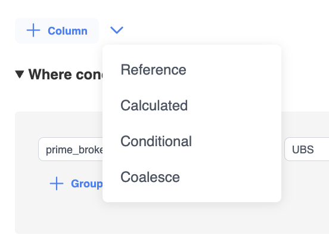
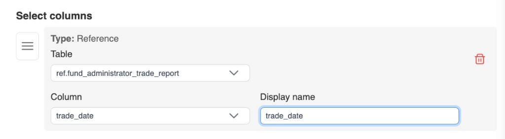
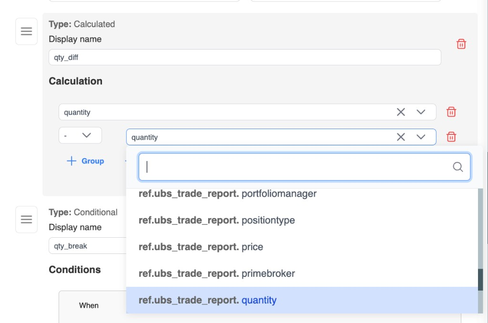
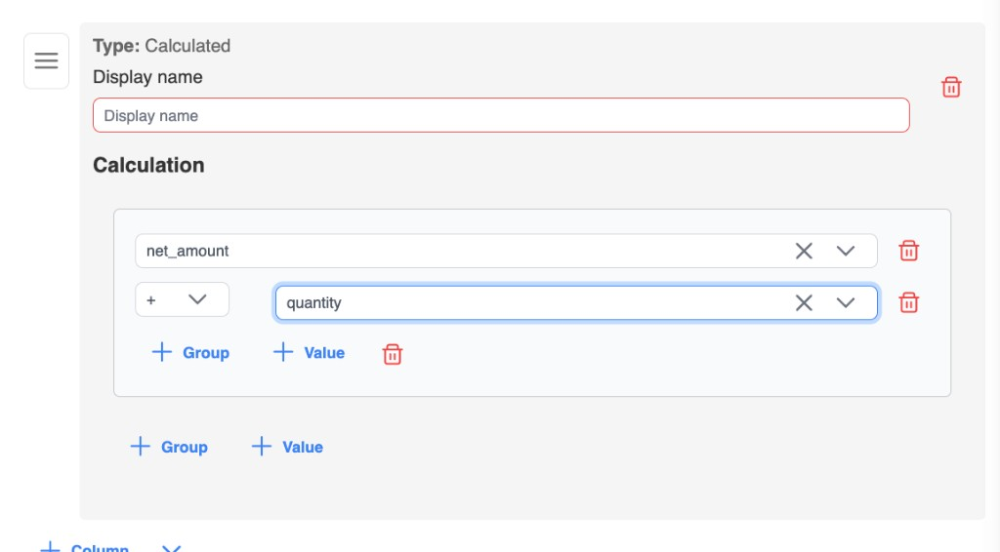
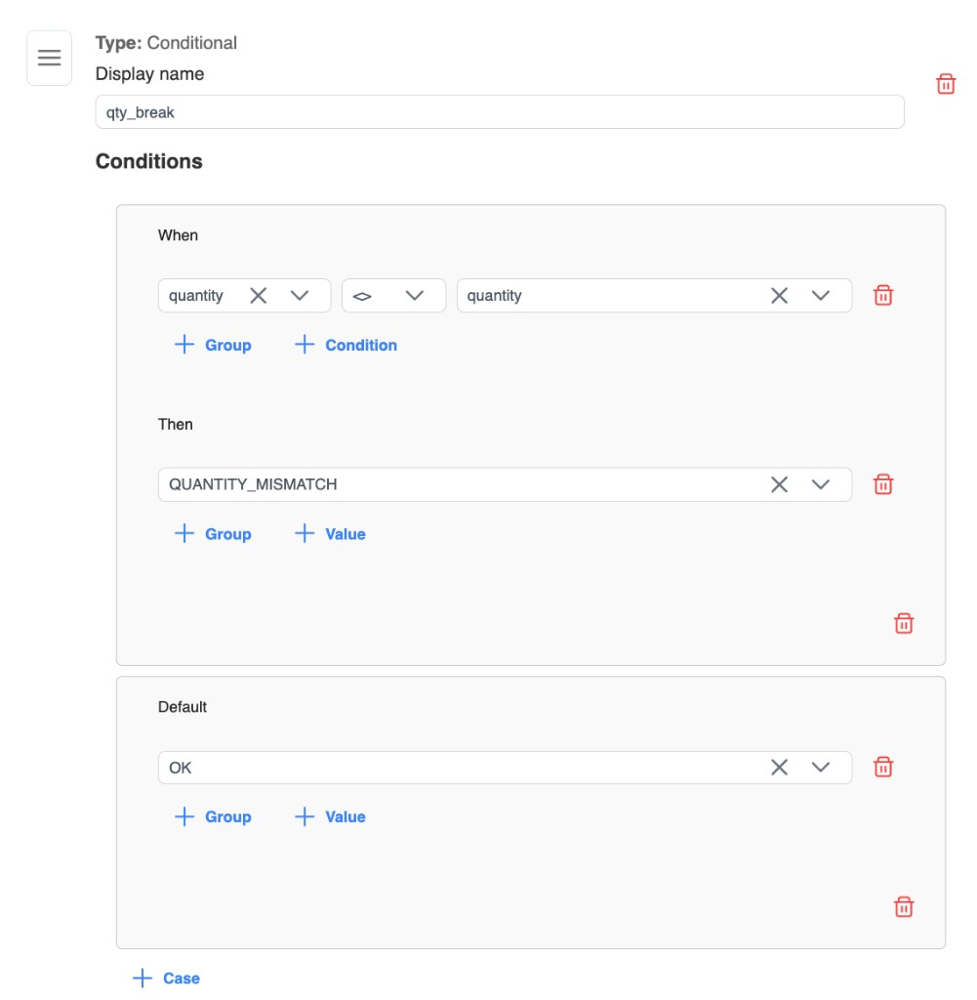
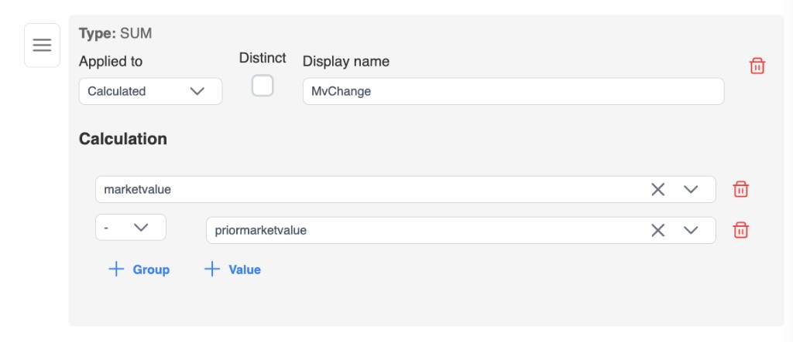

# Column types

**Select columns** define what the view returns. Use **Column** for the default type in the current mode, or open the chevron menu to pick a specific type.

## Display names

Every select column needs a **Display name**:

- Letters, numbers, and underscores only
- Must start with a letter or underscore
- Must be unique within the view

## Reference

**Reference** columns map directly to a table column.

1. Choose **Table**.
2. Choose **Column**.
3. Set **Display name** (defaults from the column name when you pick a source).

Available in both all-rows and aggregate modes. In aggregate mode, reference columns are typically your group-by dimensions.

## Calculated

**Calculated** columns build an expression from values and operators.

- Operators: `+`, `-`, `*`, `/`, `^`
- Values can be columns or custom literals
- Nest **groups** to control order of operations

In **all matching rows** mode, add a calculated column as its own select column. In **aggregate** mode, use the same expression builder as the **inner** of a SUM / COUNT / AVG / MIN / MAX measure — see [Aggregate metrics](./aggregate-metrics).

## Conditional

**Conditional** columns map to a CASE-style expression:

1. Add one or more **When** / **Then** cases (each When is a condition group, similar to where logic).
2. Optionally set a **Default** result when no case matches.

In **all matching rows** mode, add a conditional column as its own select column. In **aggregate** mode, use the same When / Then builder as the **inner** of an aggregate measure — see [Aggregate metrics](./aggregate-metrics).

## Aggregate columns

Available when [group by](./group-by) is enabled:

| Type | Purpose |
| --- | --- |
| **SUM** | Total of a numeric inner (column, calculated, or conditional) |
| **COUNT** | Count of rows (`COUNT(*)` with no column) or of an inner expression |
| **AVG** | Average of a numeric inner |
| **MIN** | Minimum value |
| **MAX** | Maximum value |

For **SUM**, **COUNT**, and **AVG**, enable **Distinct** to aggregate distinct values only (requires a column or other inner — not with empty `COUNT(*)`).

Each aggregate can wrap a **column**, a **calculated** expression, or a **conditional** CASE. Full rules, examples, and SQL shapes: [Aggregate metrics](./aggregate-metrics).

## Value types

When building calculations, conditions, or filters, values are typed as:

| Type | Used for |
| --- | --- |
| **date** | Date comparisons and date literals / presets |
| **number** | Numeric math and comparisons |
| **text** | String equality / contains |
| **boolean** | True/false comparisons |

Pick columns and custom values that match the type you intend so operators and pickers stay consistent.

## Reordering and deleting

- Drag the handle on a select column to change output order.
- Use the trash control to remove a column.
- At least one select column is required to save.
