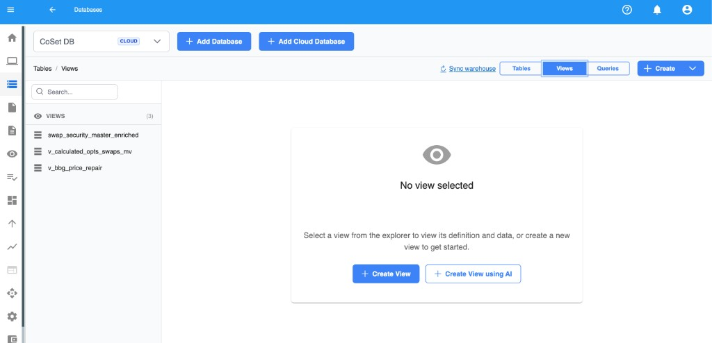
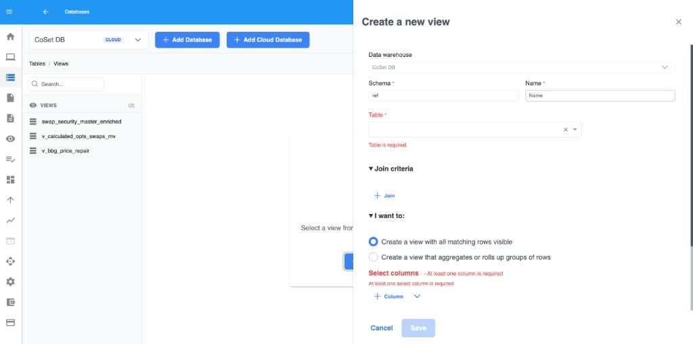
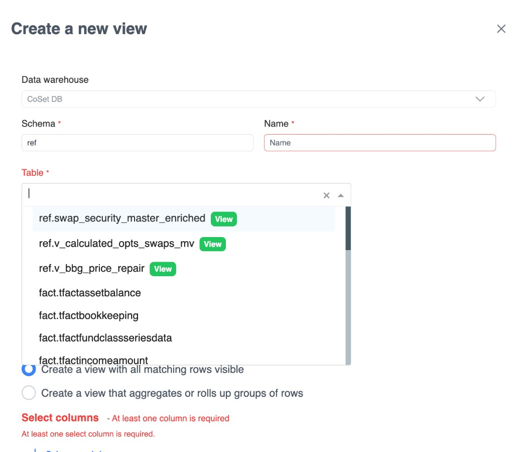
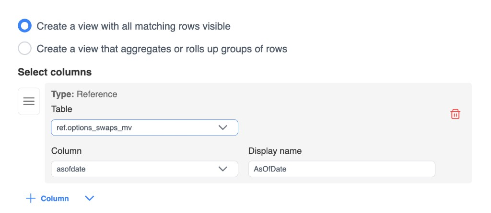

# Getting started

Create a view from the warehouse **Views** tab, then fill in schema, name, base table, columns, and optional joins or filters.

## Open the Views tab

1. Open the warehouse **Databases** area for the warehouse you want to use.
2. Select the **Views** tab.
3. Existing views appear in the explorer list on the left.

## Create a view

1. Choose **Create View** (or use the overflow menu with the same action).
2. The create sidebar opens with the view form.

To draft a view with natural language instead, see [Create with AI](./ai-views).

## Name the view

In the form header:

| Field | Notes |
| --- | --- |
| **Data warehouse** | Pre-filled; cannot be changed |
| **Schema** | Letters, numbers, and underscores only (max 20). Default is often `ref` for MSSQL / PostgreSQL warehouses |
| **Name** | Letters, numbers, and underscores; must start with a letter or underscore (max 50) |

## Choose the base table

1. Under **Table**, open the table picker.
2. Select the primary table for the view.
3. You can also pick an existing view as a source when it appears in the list.

The base table drives which tables are available for joins and which columns you can select.

## Choose row mode

Under **I want to:**, pick one:

- **Create a view with all matching rows visible** — one output row per matching input row (no `GROUP BY`).
- **Create a view that aggregates or rolls up groups of rows** — enables [group by and aggregate columns](./group-by).

## Add select columns

1. Under **Select columns**, use **Column** to add the default column type for the current mode.
2. Use the chevron menu next to **Column** to pick a specific type (reference, calculated, conditional, or aggregates when grouping).
3. Set a unique **Display name** for each column (letters, numbers, underscores; must start with a letter or underscore).
4. Drag the handle to reorder columns.

At least one select column is required. See [Column types](./column-types) for details.

## Optional: joins, filters, and grouping

| Next step | When to use |
| --- | --- |
| [Joins](./joins) | You need columns from related tables |
| [Where clauses](./where-clauses) | You need to filter rows |
| [Group by](./group-by) | You chose the aggregate / roll-up mode |

## Save

1. Review the form for validation errors (unmatched tables/columns, duplicate display names, missing columns).
2. Choose **Save**.
3. The view is created in the warehouse and appears in the Views list.

## Edit an existing view

1. Select a view in the Views explorer.
2. Open edit from the view actions / sidebar.
3. Update joins, columns, where conditions, or grouping as needed, then save.
