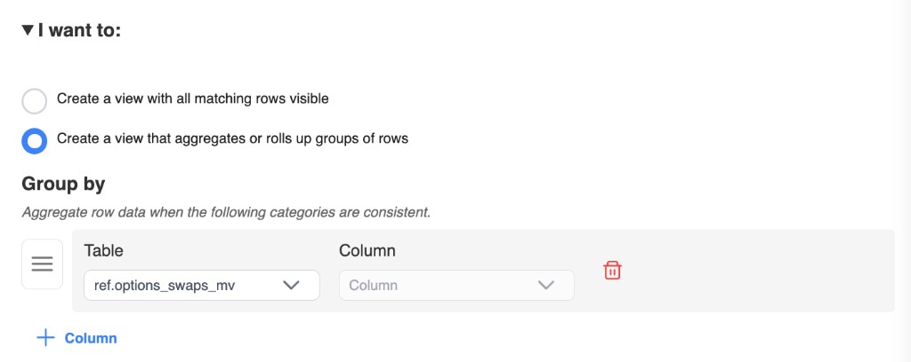
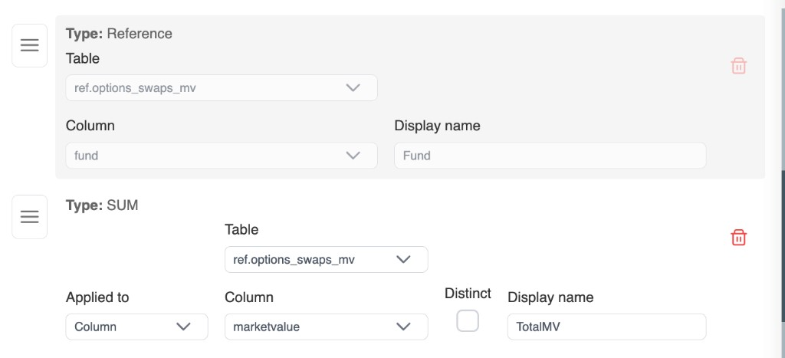
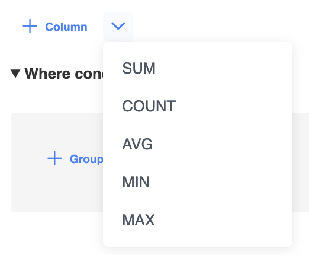
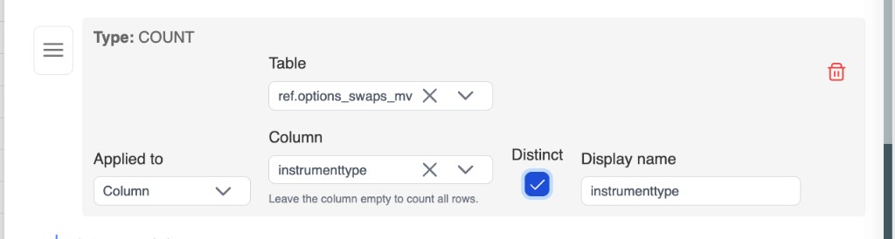

# Group by & aggregates

Use group by when you want one output row per combination of category columns, with measures rolled up using aggregate functions.

## Choose aggregate mode

Under **I want to:**, select:

**Create a view that aggregates or rolls up groups of rows**

This enables the **Group by** section and unlocks aggregate column types (SUM, COUNT, AVG, MIN, MAX).

## All matching rows vs aggregates

| Mode | Result |
| --- | --- |
| All matching rows | One row per matching input row. Aggregate column types are not available. Primary-key columns may be included so the view stays editable when browsing. |
| Aggregates / roll-up | Rows are grouped; select columns are either group-by categories or aggregates. |

Switching modes changes which column types you can add — see [Column types](./column-types).

## Add group-by columns

1. Under **Group by**, choose **Column**.
2. Pick a table and column that define a category (for example, Fund, Account, or AsOfDate).
3. Add more columns if you need a finer grain (for example, Fund **and** Strategy).
4. Drag to reorder.

The description in the form: *Aggregate row data when the following categories are consistent.*

## Select columns when grouping

In aggregate mode:

- **Reference** columns typically align with your group-by categories (the dimensions you are keeping).
- **SUM**, **COUNT**, **AVG**, **MIN**, and **MAX** measure columns summarize the rows in each group.
- Each measure can wrap a plain **column**, a **calculated** expression, or a **conditional** CASE — see [Aggregate metrics](./aggregate-metrics).

## Distinct and COUNT(*)

For **SUM**, **COUNT**, and **AVG**, enable **Distinct** so the function applies to distinct values only (for example, `COUNT(DISTINCT AccountId)`). Distinct requires an inner expression — it is not valid with empty-column `COUNT(*)`.

For **COUNT**, leaving the column empty counts all rows in the group (`COUNT(*)`).

Full rules for inners, Distinct, and examples: [Aggregate metrics](./aggregate-metrics).

## Example patterns

| Goal | Group by | Measures |
| --- | --- | --- |
| Positions by fund | Fund | SUM(MarketValue), COUNT(*) |
| Net by strategy | Strategy | SUM(MarketValue - CostBasis) |
| Long qty only | Symbol | SUM(CASE WHEN Side = 'L' THEN Qty ELSE 0 END) |
| Unique accounts per strategy | Strategy | COUNT Distinct AccountId |

## Tips

- Every non-aggregated select column should be part of the grouping logic you intend — otherwise results can be misleading.
- Combine with [where clauses](./where-clauses) to filter before aggregation (for example, only active rows).
- Combine with [joins](./joins) when categories or measures live on related tables.
- Display names must still be unique across all select columns.
