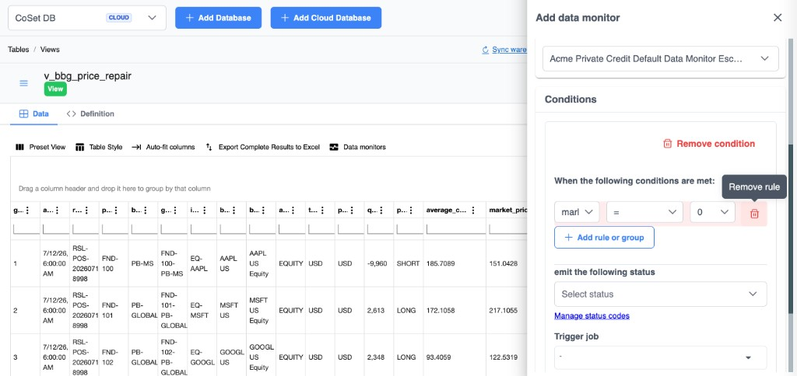
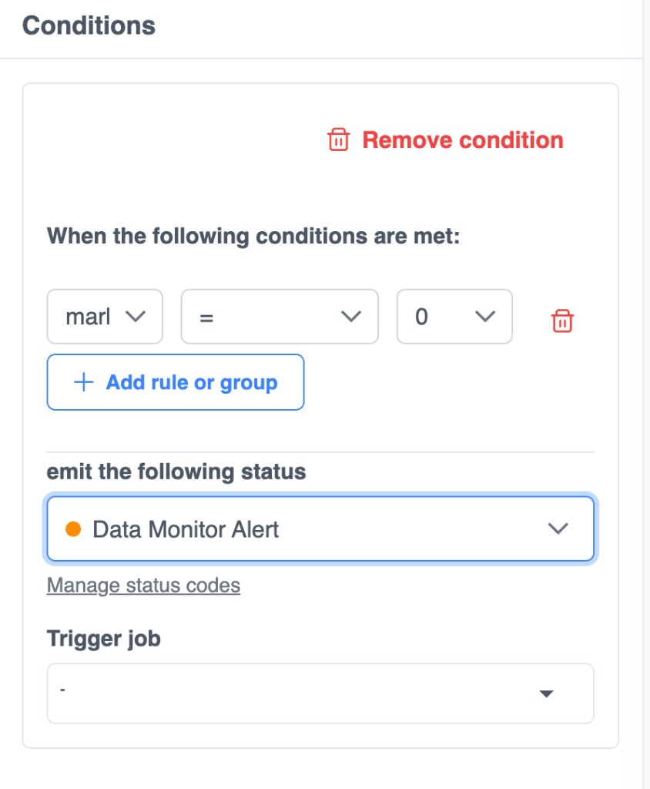

# Data monitors

Data monitors watch a warehouse **table** or **view** and react when **row conditions** match — emit a **status** (ops dashboards / escalation), optionally **trigger a job**, and (via the public API) deliver **webhooks** so external systems can react.

Use them for exception signals that already live in data: repair flags (`marl = 0`), missing prices, unmapped securities, break rows, and similar.

## Concepts

| Piece | What it is |
| --- | --- |
| **Monitor type** | Per table/view schema (columns as fields). Created automatically the first time you save a monitor for that entity |
| **Data monitor** | Named configuration on that type — conditions, escalation, ownership |
| **Condition** | Rule tree (field / operator / value, groups) + **status** to emit + optional **trigger job** |
| **Status code** | Severity label (Information, Warning, Alert, Critical, …) used for escalation and UI |
| **Alert** | Record created when a row matches a condition |

Evaluation for database table/view monitors is **data-change driven** (insert / update / delete and related warehouse writes) — not a separate cron poll of the whole table.

## When to use

| Situation | Approach |
| --- | --- |
| Exception rows already in a view | Monitor the **view** with a simple rule |
| Raw table + complex logic | Prefer a [View](/views) that isolates exceptions, then monitor the view |
| Need someone emailed / paged | Pick a status + escalation path (product), and/or subscribe to webhooks (API) |
| Need follow-on automation | Set **Trigger job** on the condition (download, load, notify, repair workflow) |

## Open a table or view

1. Open **CoSet DB** (or your warehouse **Databases** area).
2. Go to **Tables / Views**.
3. Select the table or view (for example `v_bbg_price_repair`).
4. Stay on the **Data** tab so the grid and toolbar are visible.

## Open Add data monitor

1. In the toolbar above the data grid, choose **Data monitors**.
2. The **Add data monitor** panel opens on the right.

## Configure the monitor

### 1. Choose or name the monitor

At the top of the panel, pick an existing data monitor for this table/view, or create a new named configuration. Org monitors for this entity appear in the dropdown.

### 2. Set conditions

Under **Conditions**, build rules that must match before the monitor fires:

1. Keep or add a condition group (**When the following conditions are met:**).
2. For each rule, set:
   - **Field** — column on the table/view (for example `marl`)
   - **Operator** — for example `=`
   - **Value** — comparison value (for example `0`)
3. Use **+ Add rule or group** for additional rules or nested AND/OR groups.
4. Remove a single rule with the trash icon, or the whole group with **Remove condition**.

### 3. Emit a status

When conditions are met, choose the status under **emit the following status** (for example **Data Monitor Alert**).

Built-in status codes include Information, Ok, Warning, Alert, Critical, and Error. Use **Manage status codes** to add or edit org-specific statuses.

That status drives escalation / notification paths (email, SMS, in-app **Data Monitor Alerts**) configured for the monitor.

### 4. Optionally trigger a job

Under **Trigger job**, select a workflow job to run when the condition fires, or leave `-` for status-only monitoring.

Typical triggers: email ops, kick a repair workflow, or open a data-review path.

## How evaluation works

1. A row is written, updated, or deleted on the monitored table/view (including loads and API/warehouse writes that hit that entity).
2. CoSet finds data monitors for that warehouse + entity.
3. Each condition’s rules are evaluated against the row.
4. On match, CoSet creates an **alert**, applies the condition’s **status**, notifies via the monitor’s escalation settings, and runs the **trigger job** if set.
5. External systems can subscribe to [`data_monitor.alert.created`](/api/webhooks) (and related events) on the public API.

## Example

| Setting | Example |
| --- | --- |
| Object | View `v_bbg_price_repair` |
| Condition | `marl` `=` `0` |
| Status | **Data Monitor Alert** |
| Trigger job | (none, or a follow-on repair / notify job) |

When rows in the view have `marl = 0` after a write, the monitor emits the alert status, notifies the escalation path, runs the selected job if configured, and can fire webhooks for subscribers.

## Tips

- Prefer monitoring a **view** that already isolates exceptions so rules stay simple.
- Match column names and types to the grid — the field picker lists columns from the open table/view.
- Pair a status with a **Trigger job** when someone should be emailed or a downstream workflow should run automatically.
- Use webhooks when Slack, PagerDuty, or an internal ops bus should react without polling the UI — see [Webhooks](/api/webhooks) and [Data monitors API](/api/data-monitors).
- Some monitor kinds use credentials (for example AWS IAM) configured elsewhere — see [Amazon IAM](/credentials/credential-types/amazon-iam).

## Related

| Area | Use when |
| --- | --- |
| [Data monitors API](/api/data-monitors) | Create/list monitors, conditions, status codes, and alerts over REST |
| [Webhooks](/api/webhooks) | `data_monitor.alert.*` outbound events |
| [Views](/views) | Shape exception datasets before monitoring |
| [Checklists](/checklists) | Watch monitor alerts on a period-close board |
