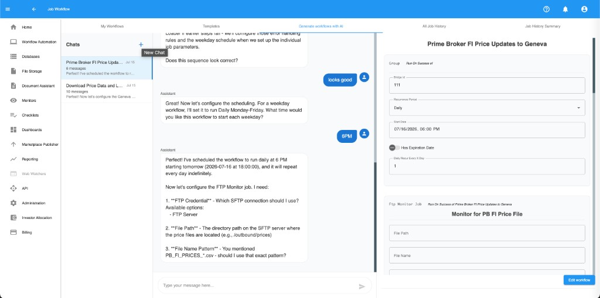
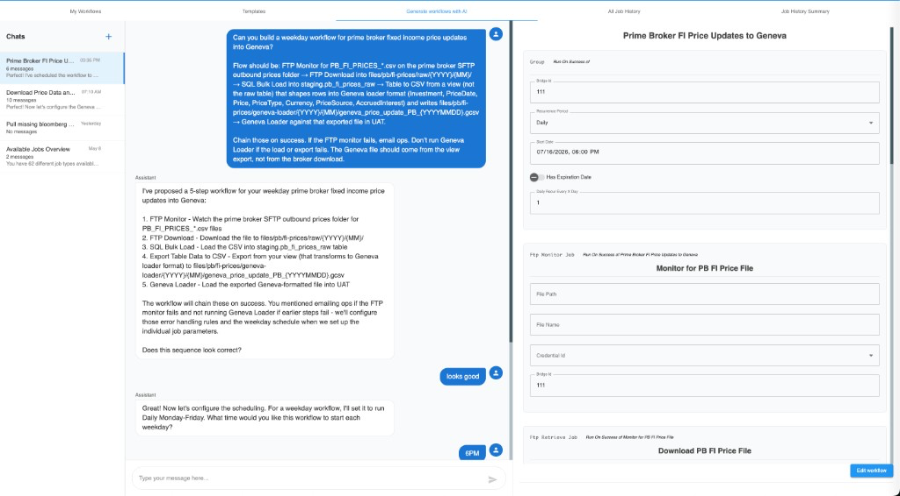

import { Callout } from 'nextra/components'

# Create with AI

**Generate workflows with AI** opens the AI workflow assistant. Describe the workflow you want in chat; the assistant drafts a tree you can review, edit, and save.

## Open the AI workflow assistant

1. Go to **Workflow Automation**.
2. Open the **Generate workflows with AI** tab.
3. The page shows a chat list, conversation pane, and a live workflow preview.

<Callout type="info">
  **Screenshot placeholder** (`ai-entry.png`)

  Placeholder: Generate workflows with AI tab in Workflow Automation.
</Callout>

## Start or select a chat

- Create a **new chat**, or
- Select an existing chat from the **Chats** list on the left.

Past chats keep their messages so you can reopen and refine a draft.

## Describe the workflow

1. In the conversation, write what you need in plain language.
2. Include useful details when you can:
   - Job sequence (monitor → download → load → transform → load to target)
   - Paths, file names, views, and credentials
   - Success / failure chaining (and who to email on failure)
   - Schedule (for example weekday at 6 PM)
3. Send the message and wait for the draft.

Example prompts:

- “Weekday workflow: FTP monitor for a broker price CSV, download it, bulk load to staging, Table to CSV from a view, then Geneva Loader — email ops if the monitor fails.”
- “Every morning, SFTP download positions, convert Excel to CSV, and run a Data Review Task.”
- “Add an On failure email after the SQL bulk load if it fails.”

## Review the draft

The assistant fills the same workflow form used for manual setup:

- Workflow title and bridge
- Recurrence / schedule
- Each job (type, title, and fields)
- Parent/child run rules (On success, On failure, Always)

Edit anything that looks wrong — treat the AI output as a starting point, not a final save.

Use **Edit workflow** when you want to change the tree outside of chat.

## Iterate

Keep chatting to refine the draft (for example, “schedule Monday–Friday at 6 PM” or “abort if the load fails”). After each change, re-check job fields, credentials, and On success / On failure links before saving.

## Save the workflow

1. Confirm the title, bridge, schedule, and each job’s fields.
2. Fix any validation errors in the form.
3. Save / create the workflow from the AI flow.
4. The new workflow appears under **My Workflows** like any other tree.

## Tips

- Name job types, paths, and credentials the way they appear in the product for better drafts.
- After save, you can still edit the tree from the normal workflow editor.
- Use [Configure workflow trees](./workflow-trees) and [Job types](./job-types) as a checklist when reviewing AI output.
