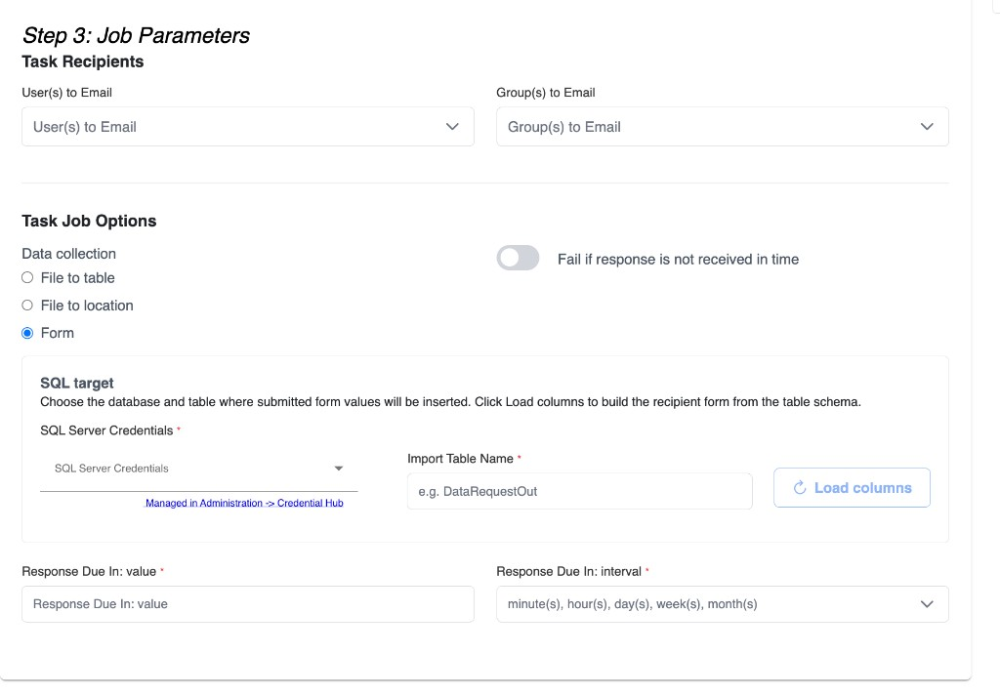

# Data request task

Send a **structured request** to people (email + in-product notification), then **wait** until they respond. Use this when you need someone to upload a file or fill a form — not when you are watching an inbox for mail they already sent ([Email Check](./email-check)).

| | |
| --- | --- |
| **Category** | Email and Communication |
| **Job type key** | `DataRequestTaskJob` |
| **Where you pick it** | Step 1: Choose Your Job Type |

## When to use it

| Need | Job |
| --- | --- |
| Ask someone to send a file or fill fields | **Data request task** |
| Watch IMAP for inbound mail / attachments | [Email Check](./email-check) |
| Ask someone to approve/reject data | [Data Review Task](./data-review-task) |

## How it works

1. Choose **recipients** (users and/or groups).
2. Choose a **data collection** mode (file to table, file to location, or form).
3. Set response due timing (or wait until they respond).
4. Recipients get email / in-app links to complete the request.
5. The workflow **pauses** on this job until the request is completed (or fails if you require a timely response).
6. Child jobs run based on parent status (**On success** / **On failure** / **Always**).



## Configure Job Fields

### Task Recipients

| Field | Required | Notes |
| --- | --- | --- |
| **User(s) to Email** | At least one user **or** group | Product users who should receive the request |
| **Group(s) to Email** | At least one user **or** group | Groups expand to members at run time |

### Task Job Options

#### Data collection

| Mode | What the recipient does | What you configure |
| --- | --- | --- |
| **File to table** | Uploads a file that lands in a SQL table | **SQL Server Credentials**, **Import Table Name** |
| **File to location** | Uploads a file to a file store / bridge folder | **Upload destination** (file store + folder) |
| **Form** | Fills fields derived from a SQL table schema | **SQL Server Credentials**, **Import Table Name**, **Load columns**, optional **default values** per column |

#### Response timing

| Field | Notes |
| --- | --- |
| **Fail if response is not received in time** | When on, missing/late responses fail the job |
| **Response Due In: value** + **interval** | Minutes / hours / days / weeks / months — or wait-for-response style interval when your org uses that option |

### Form mode details

1. Pick SQL credentials and the **Import Table Name**.
2. Click **Load columns** — CoSet builds the recipient form from the table schema.
3. Optionally set a **default value** per column (shown to the recipient; used if they leave the field blank).
4. Submitted values insert into that table.

### File to location details

Choose where uploads land:

- **Bridge Environment** — on the workflow bridge machine (browse under File Storage → Bridge Environment)
- **Organization file store** — typically S3-backed org storage

## In a workflow tree

```
Group: Collect counterparty file
 └── Data request task          [schedule or On success from prior step]
      └── SQL / transform …     [On success]
      └── Email ops             [On failure]
```

- Place after any setup the request depends on (credentials already exist; table exists for form / file-to-table).
- Branch **On success** for the happy path after the recipient completes the request.
- Branch **On failure** when timing out or failing closed matters for ops.

See [Configure workflow trees](../workflow-trees).

## Related

| Doc | Use |
| --- | --- |
| [Data Review Task](./data-review-task) | Approve/reject data instead of collecting it |
| [Email Check](./email-check) | Inbound mailbox watch |
| [Job parameter schemas](/api/job-parameter-schemas#datarequesttaskjob) | API `parameters` for create/update |
