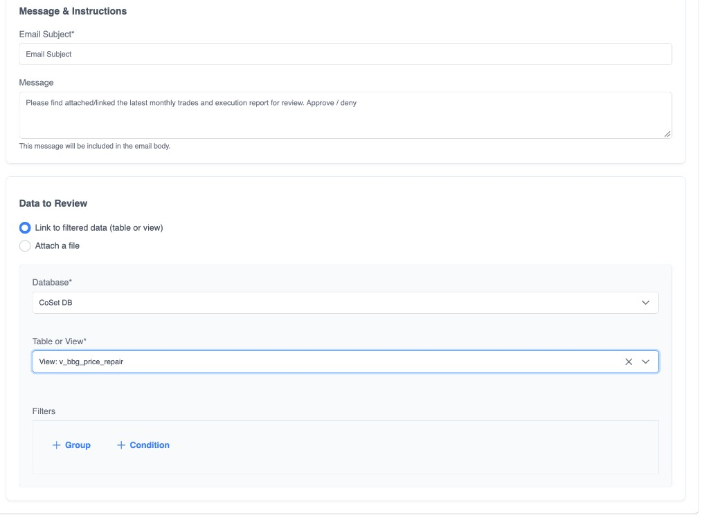

# Data Review Task

Send data to people for **review and approval**. The job **blocks the workflow** until someone **approves** or **rejects**.

Also labeled **Send Data for Review** in some UI copy. Prefer this over a plain [Quick Task](./quick-task) when the thing being approved is warehouse data or an exported file.

| | |
| --- | --- |
| **Category** | Database and Reporting |
| **Job type key** | `DataReviewTaskJob` |
| **Where you pick it** | Step 1: Choose Your Job Type |

## When to use it

| Need | Job |
| --- | --- |
| Approve / reject a dataset before the next step | **Data Review Task** |
| Ask someone to upload a file or fill a form | [Data request task](./data-request-task) |
| Lightweight yes/no with minimal data context | [Quick Task](./quick-task) |

## How it works

1. Choose **recipients** (**Users to Email** and/or **Groups to Email**).
2. Set **Email Subject** and optional **Message** (instructions for reviewers).
3. Choose **Data to Review**:
   - **Link to filtered data (table or view)** — reviewers open live warehouse rows
   - **Attach a file** — reviewers get a snapshot file (often a CSV from [Table to CSV](./table-to-csv))
4. Recipients get email / in-app links to the review screen.
5. Workflow **pauses** until approve or reject.
6. **Approve** → job succeeds → **On success** children. **Reject** → job fails → **On failure** children.



## Configure Job Fields

### Recipients

| Field | Required | Notes |
| --- | --- | --- |
| **Users to Email** | At least one user **or** group | Product users |
| **Groups to Email** | At least one user **or** group | Group membership at run time |

### Message & Instructions

| Field | Required | Notes |
| --- | --- | --- |
| **Email Subject** | Yes | Subject line for the review notification |
| **Message** | No | Included in the email body — tell reviewers what to check |

### Data to Review

#### Link to filtered data (table or view)

| Field | Required | Notes |
| --- | --- | --- |
| **Database** | Yes (in link mode) | Warehouse |
| **Table or View** | Yes (in link mode) | Entity reviewers will open |
| **Filters** | No | Where-style filters on that entity (as-of date, book, etc.) |

Best when reviewers should see **live** rows (for example a recon breaks view).

#### Attach a file

Configure file input (file store, folder, file name / date formats as shown on the form).

Best when reviewers should get a **snapshot** — typically wire **output mapping** from a prior [Table to CSV](./table-to-csv) `CalculatedOutputFile` / folder into this job’s attachment path.

## In a workflow tree

```
Group: Monthly Trades Sign-off
 └── Table to CSV                 [schedule]
      └── Data Review Task        [On success]
           └── SQL Bulk Load      [On success]   ← approved
           └── Email (ops alert)  [On failure]   ← rejected
```

| Reviewer action | Parent result | Typical child |
| --- | --- | --- |
| **Approve** | Success | **On success** — load, transmit, continue |
| **Reject** | Failure | **On failure** — email ops, stop the happy path |

### Link-only variant (no CSV)

```
Group: Positions Review
 └── Data Review Task     [schedule]
      (Link → View + filters)
      └── Email confirm   [On success]
      └── Email rejected  [On failure]
```

Full walkthrough: [Data review](../examples/data-review).

## Related

| Doc | Use |
| --- | --- |
| [Data review example](../examples/data-review) | End-to-end tree |
| [Data request task](./data-request-task) | Collect uploads / forms |
| [Table to CSV](./table-to-csv) | Common attachment producer |
| [Job parameter schemas](/api/job-parameter-schemas#datareviewtaskjob) | API `parameters` for create/update |
