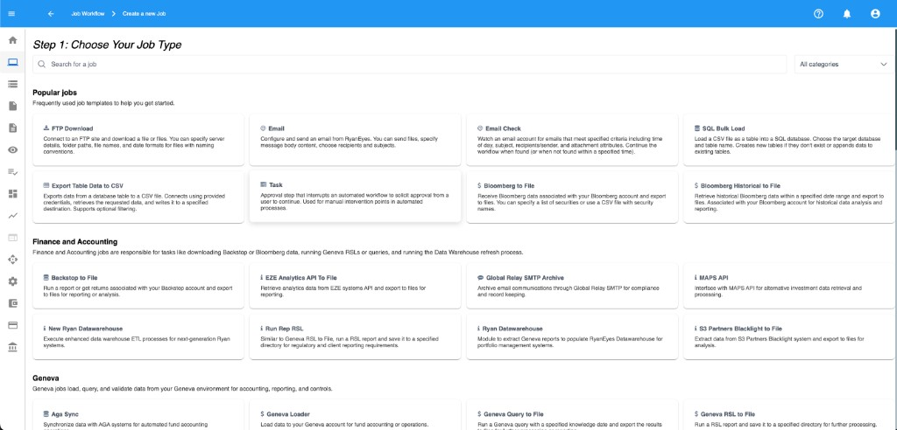
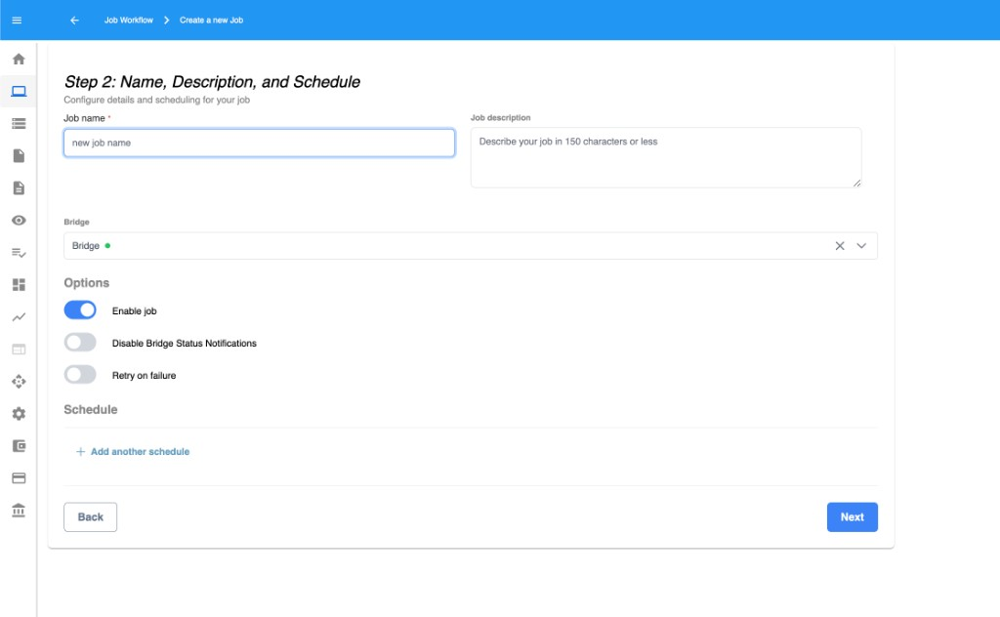
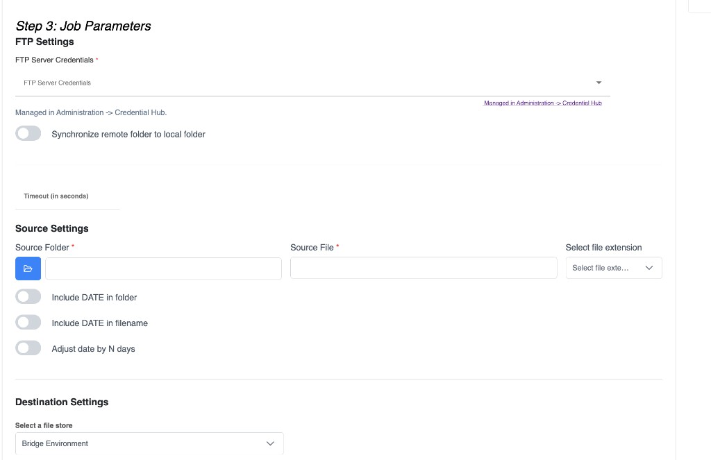
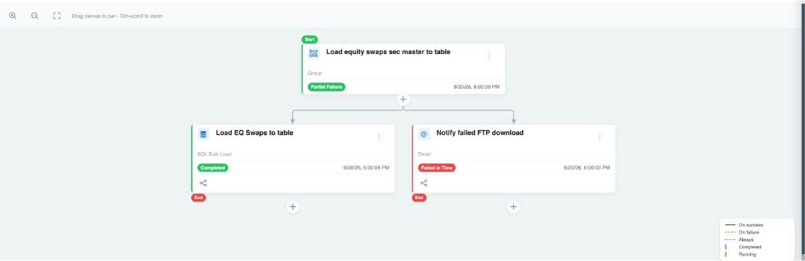

import { Callout } from 'nextra/components'

# Configure workflow trees

A workflow is a **tree of jobs**. The root is usually a **Group** (the workflow title). Everything else hangs under it as children.

## Open a workflow

1. Go to **Workflow Automation**.
2. Open a workflow (or create one).
3. You see the **tree** (boxes and lines) and can add / edit jobs.


## Words you’ll see

| Term | Meaning |
| --- | --- |
| **Group** | Root organizer / title. Does not do work by itself. |
| **Job** / **Workflow Item** | One step (a job type). |
| **Child Job** | A job that runs after its parent (by schedule rule). |
| **Bridge** | The machine/agent that executes jobs. |
| **Schedule** | When a job runs on its own clock. |
| **On success** | Child runs only if the parent succeeded. |
| **On failure** | Child runs only if the parent failed. |
| **Always** | Child runs when the parent finished, success or failure. |

## Create a new workflow

1. Add a workflow / Group and give it a clear name (for example, `Daily Broker Files`).
2. Select the Group.
3. Choose **Add Child Job** (or **Add Workflow Item**).
4. Walk the stepper:

### Step 1 — Choose Your Job Type

Search or browse by category (**Email and Communication**, **Systems and Security**, **Database and Reporting**, **Finance and Accounting**, **Other**).



### Step 2 — Name, Description, and Schedule

- Name the job.
- Either give it an **Independent schedule**, or choose **Run job based on parent status**.



### Step 3 — Job Parameters

Fill in the type-specific settings (mailbox, FTP path, table/view, recipients, and so on).



To pass a file path or other result into the next job, use **Output mapping** on the **child** — see [Parameters and outputs](../parameters).

## Parent → child run rules

When a child uses **Run job based on parent status**, pick one:

| Option in the form | Edge on the tree | Meaning |
| --- | --- | --- |
| **Run on Success** | **On success** | Parent worked → child runs |
| **Run on Failure** | **On failure** | Parent failed → child runs |
| **Run on Success or Failure** | **Always** | Parent finished either way → child runs |

Typical pattern:

- Happy path children → **On success**
- Alert / escalate → **On failure**
- Cleanup that must happen either way → **Always**



## Independent schedule vs parent status

| Mode | Use when |
| --- | --- |
| **Independent schedule** | This job starts the chain (or runs on its own clock). |
| **Run job based on parent status** | This job should wait for the parent to finish. |

Root children under a Group often have a schedule. Deeper children usually depend on parent status.

## Common tree actions

- **Add Child Job** — grow the tree
- **Edit Job** — change type fields, schedule, or run rule
- **Copy / Cut / Paste** / **Paste as child** — reuse structure
- **Run Job** / **Run Job as Configured** — test now
- **Delete** — remove a node (and usually its children)

<Callout type="info">
  **Screenshot placeholder** (`workflow-node-menu.png`)

  Placeholder: Right-click / menu on a job node with Add Child, Edit, Run, Delete.
</Callout>

## Tiny example tree

```
Group: Morning Positions
 └── FTP Download          [daily 7:00]
      └── Table to CSV     [On success]   ← optional export of a view
           └── Data Review Task [On success]
                └── Email  [On success]   ← approved
                └── Email  [On failure]   ← rejected
```

See [Examples](../examples) for full walkthroughs.

## Tips

- Name jobs after the business step (`Download PB file`, not `FTP Download 3`).
- Keep trees shallow when you can — easier to read and debug.
- Put human gates (**Task** / **Data Review Task**) only where a person must decide.
- Check **Job History** after a test run before turning on the real schedule.
- Pass landing files into the next job with [output mappings](../parameters) instead of hard-coding paths.
